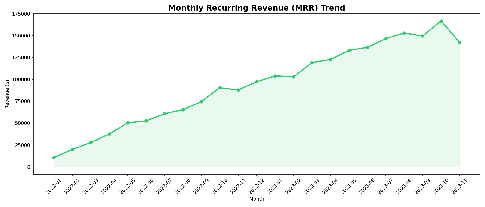
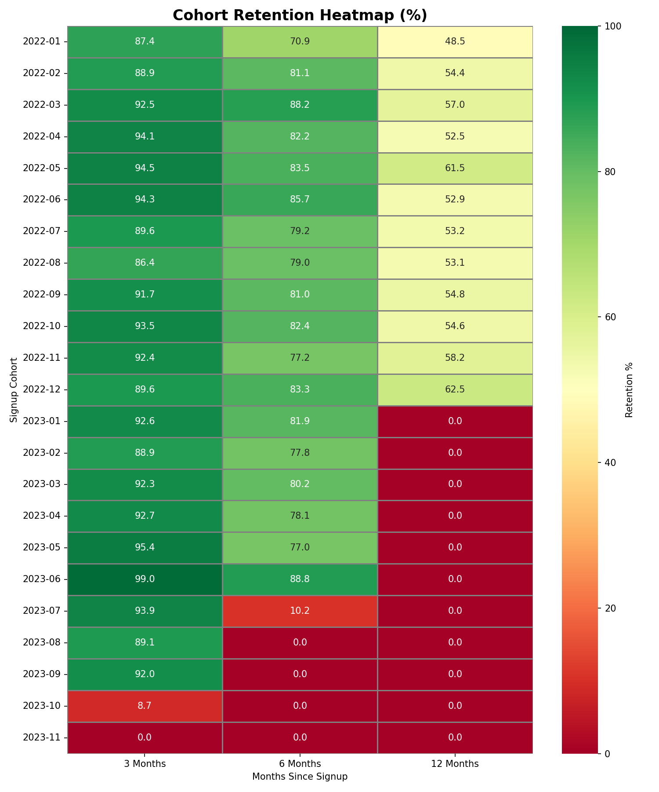
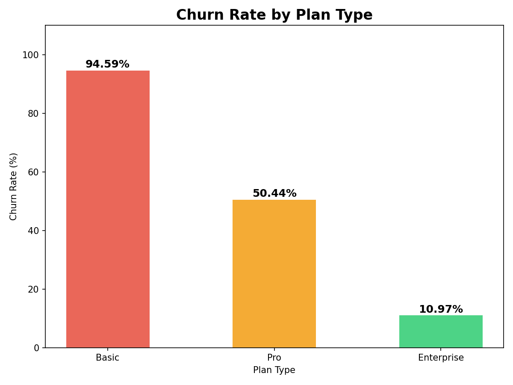

# 📊 Subscription Revenue Analysis
### SQL • Python • Power BI • PDF Case Study


---

## 🧩 Business Problem
CloudSub Inc. experienced slowing revenue growth despite steady new customer acquisition. 
Leadership suspected churn was the primary driver but lacked visibility into **which segments 
were churning, when churn was occurring, and what the true revenue impact was.**

This analysis was built to answer those questions and deliver actionable recommendations 
backed by data.

---

## 🔍 Key Findings

| # | Finding | Impact |
|---|---------|--------|
| 1 | Basic plan customers churn at **94.59%** vs 10.97% for Enterprise | Critical |
| 2 | **59.58%** of churned customers had a failed payment 30 days prior | Actionable |
| 3 | Enterprise CLV (**$4,977**) is 22x higher than Basic ($221) | Strategic |
| 4 | Churn rate grew **66x** over 18 months (0.05% → 3.3%) | Urgent |

---

## 💡 Recommendations Summary

| Initiative | Estimated Monthly Impact | Annual Impact |
|------------|--------------------------|---------------|
| Automated Dunning System | ~$15,000 | ~$180,000 |
| Basic Plan Churn Reduction | ~$4,100 | ~$49,200 |
| Enterprise Focus Strategy | High CLV gain | Long term |
| **TOTAL** | **~$19,100/month** | **~$229,200/year** |

---

## 🛠️ Tools & Technologies

- **Database:** MySQL — data storage and 7 SQL queries
- **Language:** Python — Pandas, Matplotlib, Seaborn, Plotly
- **Dashboard:** Power BI — 3 pages with DAX measures and navigation
- **Notebook:** Jupyter Notebook
- **Report:** PDF Case Study generated with ReportLab

---

## 📁 Project Structure
```
subscription-revenue-analysis/
│
├── 📓 subscription_analysis.ipynb    ← Full Python analysis notebook
├── 📊 subscription_dashboard.html    ← Interactive Plotly dashboard
├── 📄 subscription_analysis_case_study.pdf  ← PDF business report
├── 📋 final_recommendations.txt      ← Recommendations summary
├── 📈 cohort_data.csv                ← Cohort retention data
│
├── /sql
│   ├── 01_mrr_trend.sql
│   ├── 02_churn_rate.sql
│   ├── 03_churn_by_plan.sql
│   ├── 04_revenue_churn.sql
│   ├── 05_customer_ltv.sql
│   ├── 06_failed_payments.sql
│   └── 07_cohort_retention.sql
│
└── /charts
    ├── mrr_trend.png
    ├── churn_rate.png
    ├── churn_by_plan.png
    ├── clv_by_plan.png
    ├── cohort_heatmap.png
    └── failed_payments.png
```

---

## 📊 Dashboard Preview

### Executive Summary


### Cohort Retention Heatmap


### Churn by Plan Type


---

## 🗄️ Database Schema
```sql
customers         — customer_id, signup_date, plan_type, acquisition_channel
subscriptions     — subscription_id, customer_id, start_date, end_date, status, mrr
payments          — payment_id, customer_id, payment_date, amount, payment_status
```

**Dataset:** 2,000 customers | 2,000 subscriptions | 18,167 payments | 24 months

---

## 🚀 How to Run This Project

1. Clone the repository
2. Set up MySQL and run the data generation script
3. Open `subscription_analysis.ipynb` in Jupyter Notebook
4. Update the database connection with your credentials
5. Run all cells in order

---

## 📬 Contact

**Author:** [Sanskriti]  
**Email:** [Sanskritigranth@gmail.com]  
**LinkedIn:** [www.linkedin.com/in/sanskriti-878845312]  
**GitHub:** [https://github.com/Sanskriti727]
